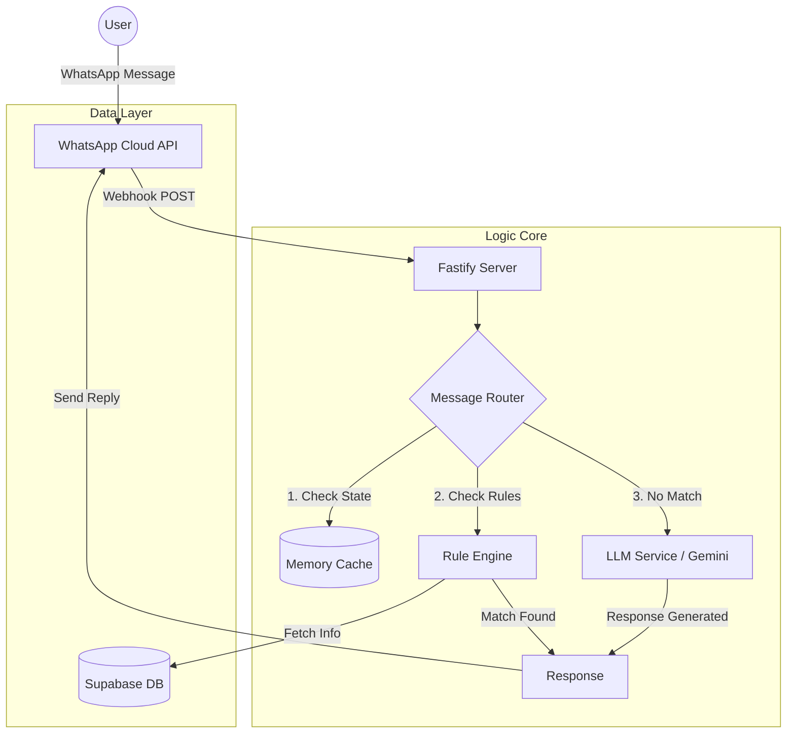

# Implementation Plan - Hybrid Conversational Chatbot

## Goal Description
Build a lightweight, high-performance conversational commerce chatbot for WhatsApp. The system will use a **Hybrid Architecture**: heavily relying on efficient, hardcoded logic for common queries (Catalogue, Price, Location) to ensure speed and zero cost, while falling back to a free-tier LLM (Google Gemini Flash) only for complex intent handling.

## Proposed Tech Stack ("Lightweight & Max Performance")

### Core Backend
- **Runtime**: **Node.js (v20+)** with **TypeScript**.
    - *Reason*: Massive ecosystem for WhatsApp libraries, excellent JSON handling.
- **Framework**: **Fastify**.
    - *Reason*: Significantly faster (2x-3x) than Express with lower overhead. Ideal for high-throughput webhooks.
- **Hosting**: **Render** or **Railway** (Dockerized).

### Database & Storage
- **Primary DB**: **Supabase (PostgreSQL)**.
    - *Reason*: Robust, relational (good for Orders/Products), offers a great Free Tier.
- **Caching**: **Node-Cache** (In-memory).
    - *Reason*: Avoid hitting the DB for every "Menu" request. Keep active user sessions in memory for extreme speed.

### DevOps & Environment
- **Local Dev**: **Docker & Docker Compose**.
    - *Reason*: Ensures the environment (Node version, OS validation) is identical on your laptop and the server.
- **Deployment**: **Docker Container** OR **Standard Node.js**.
    - *Reason*: Can run on modern PaaS (Render, Railway) OR traditional VPS (GoDaddy, Hostinger) supports Node.js.

### AI & Intelligence
- **LLM**: **Google Gemini 1.5 Flash**.
    - *Reason*: Designed for speed and high volume. Free tier is generous. 
- **Voice**: **OpenAI Whisper** (via API or local `faster-whisper` if Docker constraints allow).

### Messaging
- **Provider**: **WhatsApp Cloud API** (Official).
    - *Reason*: Stable, reliable, no risk of banning.
- **Fallbacks**: Standard SMS (if needed later).

---

## Architectural Changes

### [Backend Structure]
The backend will be organized into a modular "Router" pattern to strictly separate "Fast Path" (Rules) from "Slow Path" (AI).

### [NEW] Docker Configuration
- **Dockerfile**: Optimized multi-stage build for small image size.
- **docker-compose.yml**: For local development, spinning up the app using the `builder` stage (to include dev dependencies) and potentially a local Redis.

#### [NEW] src/server.ts
Entry point. Initializes Fastify and registers the Webhook routes.

#### [NEW] src/router/messageRouter.ts
The "Traffic Cop".
1. Receives message.
2. Checks **Cache** (is user in a specific flow? e.g., waiting for location).
3. Checks **RuleEngine** (Regex matches).
4. If no match -> Sends to **LLMService**.

#### [NEW] src/services/RuleEngine.ts
A high-performance pattern matcher.
- **Input**: User text.
- **Logic**: Iterates through a Map of `RegExp` -> `Action`.
- **Output**: Immediate response object or `null`.

#### [NEW] src/services/LLMService.ts
Handles the fallback.
- Sanitizes input.
- Appends "System Prompt" (Context about the shop).
- Calls Gemini Flash API.
- Returns text.

#### [NEW] src/services/Database.ts
Supabase client wrapper for fetching:
- `getProducts(category, location)`
- `getOrderStatus(orderId)`

---

## Data Flow Diagram

## Verification Plan

### Automated Tests
- **Unit Tests**: Test `RuleEngine` with 100+ sample phrases to ensure it catches "Price", "Catalog", etc., without triggering the LLM.
- **Load Test**: Simulate 100 concurrent webhooks to verify Fastify stability.

### Manual Verification
- **Flow Test**:
    1. Send "Hi" -> Expect Menu (Instant).
    2. Send "Iron Tawa" -> Expect PDF (Instant).
    3. Send "My tawa is rusting, help!" -> Expect LLM advice (Fallback).
    4. Send Audio -> Expect Transcript + Answer.
